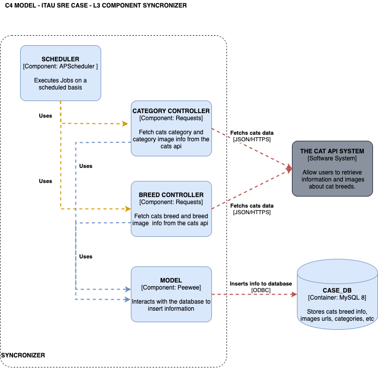
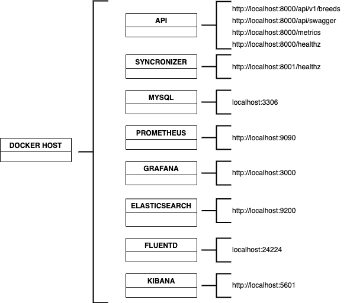
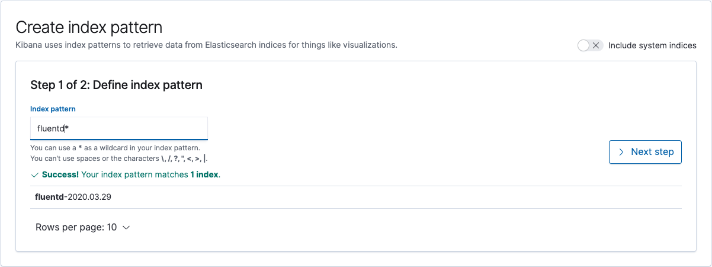
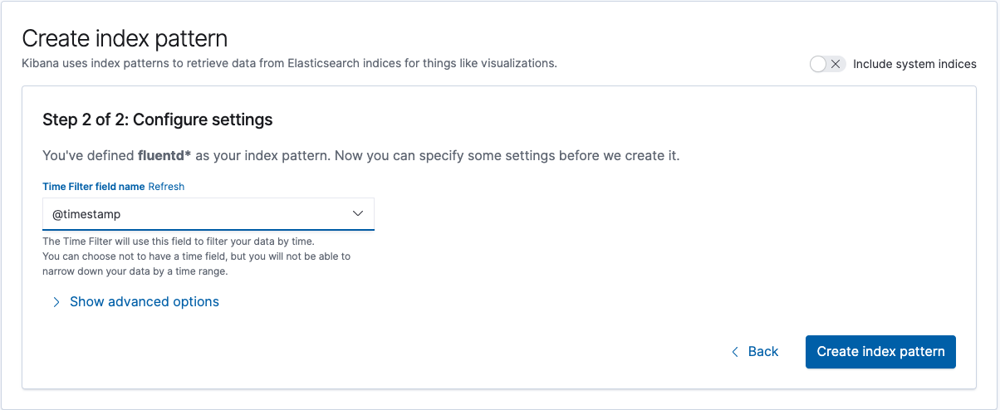
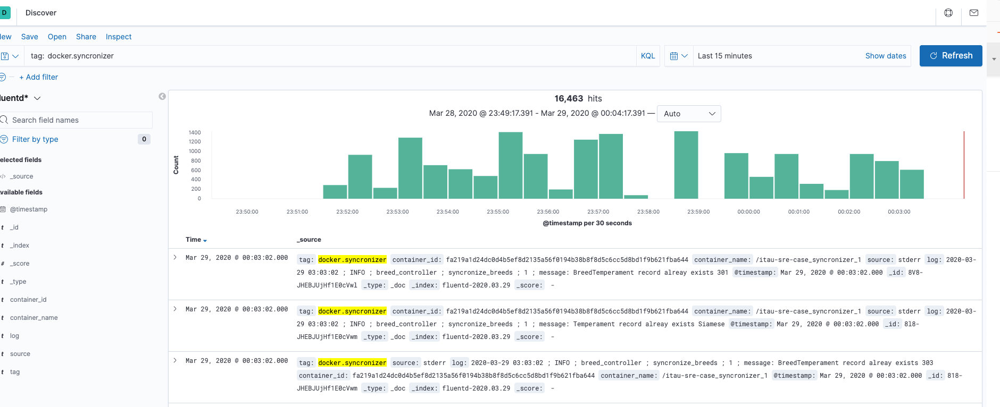
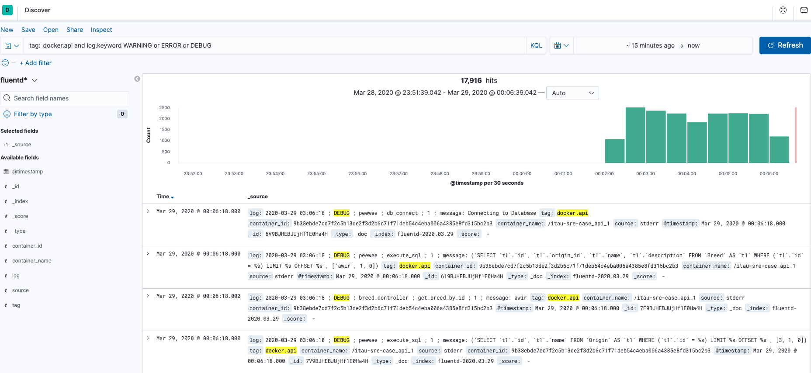
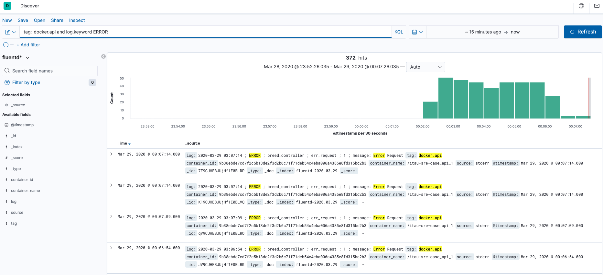
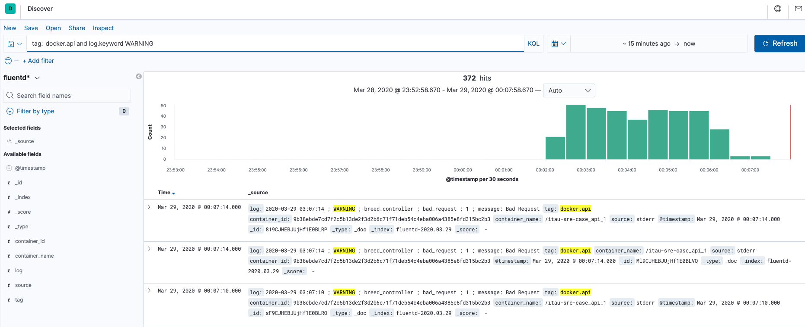
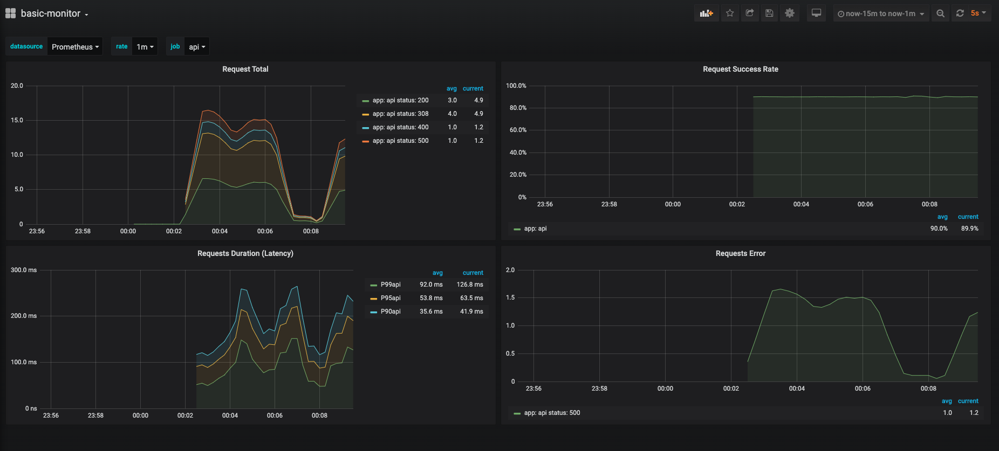
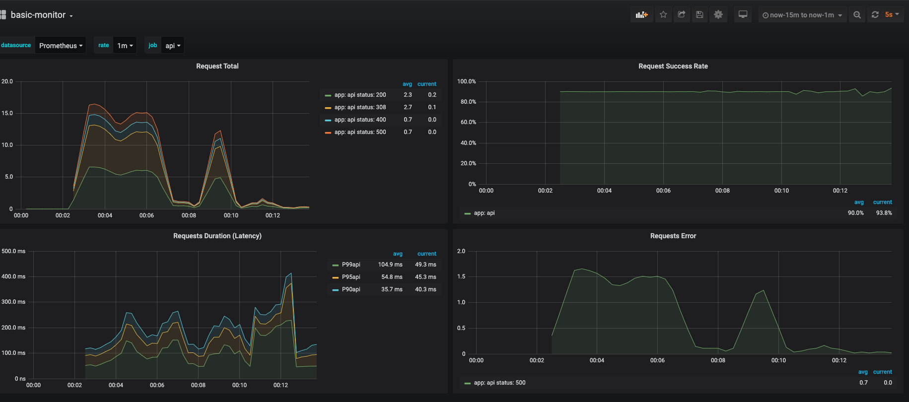

# **Itau SRE Case - thecatapi.com**

## **OVERVIEW**

### **SOLUTION**
The solution is based on two components, the first one is a service responsible for fetch/syncronize data from thecatapi.com API and persist it on a relational database. The second component is responsible for expose an API where consumers can retrieve data in a JSON format.


### **STACK**
The solution is based on the following technology stack:

#### **LANGUAGE AND COMPONENTS**
  - Python3
  - Peewee ORM framework
  - Flask web framework
  - APScheduler 
  - Prometheus Flask Exporter
  - Requests 
  - Swagger UI Py
  - MySQL Client
  - MySQL8x database

#### **TOOLS**
  - Postman Collection for API Testing
  - GitHub as repository
  - docker-compose for local run
  - docker for local dev
  - CircleCI for docker image build and push to docker registry

#### **LOGGING AND METRICS**
  - EFK (ElasticSearch / FluentD / Kibana) for log aggregation and visualization
  - Prometheus and Grafana for Metrics aggregation and visualization

### **SOFTWARE DOCUMENTATION**

#### **C4 MODEL**




#### **ERD**


### **GETTING THIS PROJECT**
  I will send a copy of this project to you in an email attachment but if you don't receive it due to antispam restrictions, this repository is temporary public and you can clone it using the following command:

  ``` git clone https://github.com/EltonRibeiro7/itau-sre-case.git ```

### **DEVELOPMENT**

  If you want to develop new features or fixes, I recommend you to use an local mysql docker container. The following comand start one mysql instance that matches all required config to execute component code (eg: api component: "api/python3 app.py"). Don't forget to install all requirements in requirements.txt (**mysqlclient** requires extra config, details [here](https://pypi.org/project/mysqlclient/1.4.6/))
  
  ```
  docker run --name mysql -e MYSQL_ROOT_PASSWORD=case_pass -e MYSQL_USER=case_user -e MYSQL_DATABASE=case_db -e MYSQL_PASSWORD=case_pass -p 3306:3306 -d mysql:8.0.19
  ```

### **LOCAL RUN**


In order to run all components together, including EFK and Prometheus/Grafana, I chose a tool called docker-compose which permits running diferent containers with diferent requirements in a more declarative way (a single spec file called docker-compose.yaml on project root folder). However, you will need to have [docker](https://docs.docker.com/install/) and [docker-compose](https://docs.docker.com/compose/install/) installed on your machine. Since I am using the lastest version of docker (19.03.8) and docker-compose (1.25.4) at the time of this case development, I recommend you to use the same version. 

Tested on MacOS and Ubuntu 18.04:

**IMPORTANT:**  If you are using Windows, it might be necessary to adjust paths on docker-compose to meet your OS requirements.

#### **DOCKER COMPOSE**   

Components details related to the environment are described below. Some components requires additional configuration so I centralized them on the folder infra under project root folder but don't worry, docker-compose spec file already has mappings to the folder and will do everything for you, even putting a dashboard on grafana. 


- **TOPOLOGY**
  
  

- **DETAILS** 
    - Containers:
      - fluentd
      - elasticsearch
        - Access URL: http://localhost:9200 (exposed only for demonstration purpose)
        - 
      - kibana
        - Access URL: http://localhost:5601
      - prometheus
        - Access URL: http://localhost:9090 (exposed only for demonstration purpose)
      - grafana
        - Access URL: http://localhost:3000 
          - User: admin (default for demonstration purpose)
          - Pass: admin (default for demonstration purpose)
        - Grafana Dashboard: http://localhost:3000/d/NPenqc9Zz/basic-monitor?orgId=1
      - mysql
        - DB: case_db
          - User: case_user 
          - Pass: case_pass
      - api
        - Base API URL: http://localhost:8000/api/v1/
        - Swagger UI URL: http://localhost:8000/api/swagger
        - HealthCheck (unfinished, only checks if it is alive) URL: http://localhost:8000/healthz
        - Prometheus Metrics URL: http://localhost:8000/metrics
      - syncronizer
        - HealthCheck (unfinished, only checks if it is alive) URL: http://localhost:8001/healthz


- **HOW TO USE**

  - **IMPORTANT:** Before continuing, please configure your docker machine with at least 4GB of RAM (the full stack consumes a lot :P)
  
  Once you have installed docker and docker-compose, just go to the project root folder using bash (linux or mac), and type ```docker-compose up --build -d ```

  More Examples:
  - Start in background: ```docker-compose up --build -d ```
  - Stop environment: ```docker-compose stop```
  - Remove everything: ```docker-compose down -v```

  Troubleshooting:
  - I am using only high ports but ensure that you don't have services running on those ports otherwise docker-compose will fail to start.


### **NAVIGATING THROUGH THE SOLUTION**

#### **SWAGGER**

You can use swagger to discover every operation and option available on the API component

#### **POSTMAN**

There is a folder under project root called postman. Under this folder, there is a 2.1 version postman collection. You can import it on your postman and use some existing examples to fetch info from de api.

#### **KIBANA**

You can use kibana to watch for logs, API is configured to log everything (DEBUG mode) whereas SYNCRONIZER is configured to log INFO and above but you can adjust the level on the docker-compose.yaml file. In order to start using kibana, please follow the steps bellow:

- Create index Pattern:
  Under Index Pattern, type fluentd* then proceed to the next step.
  

- Configure Settings
  Under Time Filter Field, select @timestamp and then press "Create Index Pattern"
  

- Start Using :) 


- **EXAMPLE:**









#### **GRAFANA**

You can use grafana to watch API behaviour using the following dashboard:

[Grafana basic-monitor](http://localhost:3000/d/NPenqc9Zz/basic-monitor?orgId=1&from=now-1h&to=now-1m)


- **EXAMPLE:**





### **TO DO**

#### **MUST HAVE**
- Unit tests
- Integration tests

#### **SHOULD HAVE**
- API to manage and monitor syncronizer component:
  - stop scheduler
  - show execution status
  - start scheduler
- API to retrieve category and images

#### **NICE TO HAVE**
- Use terraform to setup a k8s cluster on DigitalOcean (demonstration only)
- Script deployment for EFK, Prometheus Operator and Nginx Ingress
- Configure CircleCI to deploy to DigitalOcean K8S cluster
- Create k8s specs for api, mysql and syncronizer
- Use local development with skaffold and minikube instead of docker-compose.
